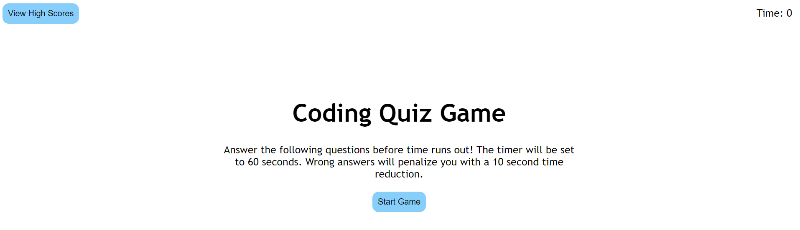

# 4-code-quiz
This assignment was assigned by the U.C. Berkeley Extension Full-time Full Stack Flex Boot Camp.
This is assignment 4 for the program. In this assignment I created a coding themed quiz application. The application consists of creating a timed quiz with multiple-choice questinos. The app runs in the browser and features dynamically updated HTML and CSS powered by JavaScript code. It has a clean, polished, and responsive user interface.

It contains notable features such as:
- A timer
- dynamically rendered questions that swap once the user inputs an answer
- A time deduction penalty upon choosing an incorrect answer
- game resolution based once the time expires or all questions are answered
- A locally saved scorescreen with recorded user initials input

Due: Tuesday, March 30, 2021 11:59 PM

## Built With

* [HTML](https://developer.mozilla.org/en-US/docs/Web/HTML)
* [CSS](https://developer.mozilla.org/en-US/docs/Web/CSS)
* [Javascript](https://developer.mozilla.org/en-US/docs/Web/JavaScript)

## Deployed Link

* [See Live Site](https://acedyu.github.io/4-code-quiz/)

## Authors
AcedYu
- [Link to Github](https://github.com/AcedYu)
- [Link to LinkedIn](https://www.linkedin.com/in/alex-yu-3712811b9/)